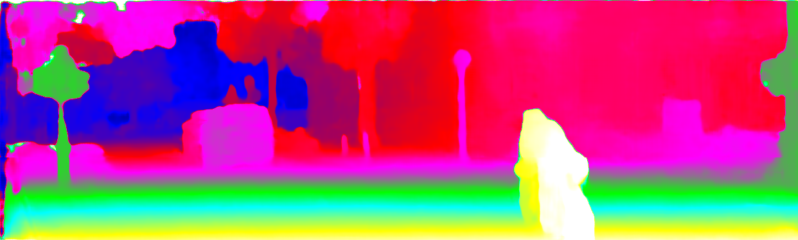
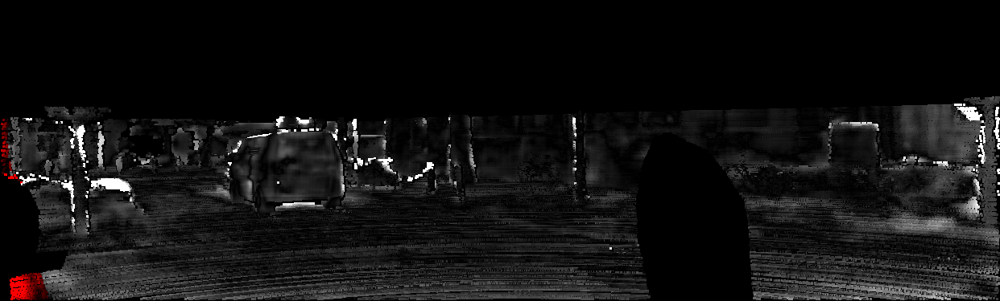
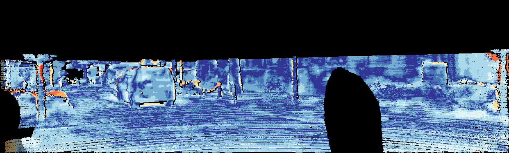
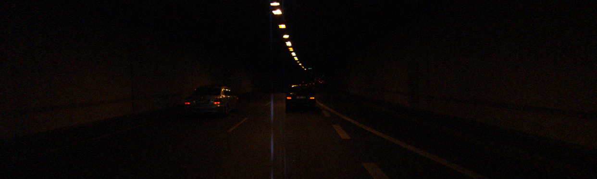
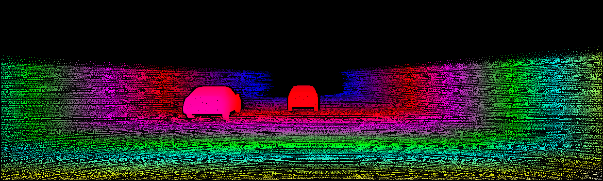
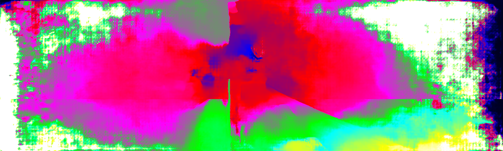
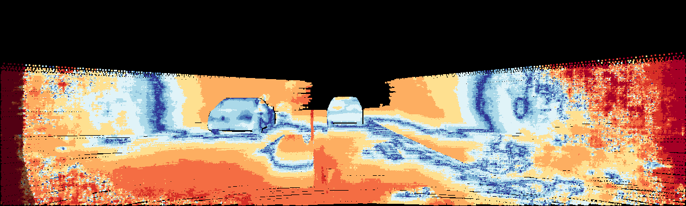

# Updated KITTI devkit Code for Error Maps, Color Disparity Generation, and pfm2uint16png and uint16png2pfm Converting

## Compilation

The `CMakeLists.txt` file is provided for convenient compilation. Just run the following:

```
cd kitti-devkit # assuming its the root dir for this reporsitory
mkdir build
cd build
cmake ..
make
```

The compiled libraries or executables will be found at `./lib` and `./build` sub-directory, respectively.

## Change your pfm disparity to png format:

Assuming your disparity prediciton is in `.pfm` format. KITTI devkit code accepts `PNG` disparity maps for evaluation. So firstly, coverting the `pfm` to `png` ones.

```
# line 44 in file kt_errorMap.sh
./build/pfmDisp2png $pfm_file $png_file
```

where, executable `pfmDisp2png` will convert source file `$pfm_file` to target file `$png_file`. The detailed commands are shown in file `kt_errorMap.sh`.

## Evaluation for Error Maps and Color Disparities

Based on the png disparity maps, we can do evaluation, via:

### KITTI 2015:

```
# kitti 2015: line 48 in file kt_errorMap.sh
./build/evaluate_stereokt15 $result_sha $isLogColor
```

where, `$result_sha` is the disparity input for evaluation, and `$isLogColor` is a flag for using KITTI LogColor (if isLogColor=true) or not (if isLogColor=false).

This will result in 
- the error maps at `errors_disp_img_0/`,
- the color disparity maps at `result_disp_img_0/`,

both under the same location as your input disparity maps for evaluation.

### KITTI 2012:

```
# kitti 2012: line 77 in file kt_errorMap.sh
./build/evaluate_stereokt12 $result_sha $isLogColor
```

where, `$result_sha` is the disparity input for evaluation, and `$isLogColor` is a flag for using KITTI LogColor (if isLogColor=true) or not (if isLogColor=false).

This will result in 

- the error maps at `errors_img/`,
- the color disparity maps at `disp_ipol/` and `disp_orig/`,

both under the same location as your input disparity maps for evaluation.

### One Example from KITTI 2015:

The following shows the input disparity, the color version disparity, error map (w/o and w/ log color), and the KITTI error scale:

- 
- 
- 
- 
- 

## Generate KITTI-color-map Disparities for Middlebury 2014, ETH3D (and KITTI of course)


The executable `./build/get_color_disp` is used to directly convert your `.pfm` disparity prediction to color `.png` files. 

### Conver disparity prediction to color png version

We provide the `bash` file `get_color_disp.sh` for Middlebury 2014 and KITTI 2015.

```
#line 44
app=./build/get_color_disp
# for middlebury, line 57
$app $gt_disp_file $input_disp_file $output_disp_file

# for KITTI 2015, line 84
$app $gt_disp_file $input_disp_file $output_disp_file
```

where,
- `$app` is the executable;
- `$gt_disp_file` is the ground truth disparity;
- `$input_disp_file` is the input disparity, i.e., your predicted disparity file in `pfm` format;
- `$output_disp_file` is the `color png` disparity output.

### Convert ground truth disparity to interpolated color png version

Still use the exectuable `get_color_disp`, with `$input_disp_file` set be equal to `$gt_disp_file`. See the bash file `get_color_disp.sh` for details.

Take a hard image `000104_10.png` from KITTI 2015 as an example, we show the reference image, 
color interpolated ground truth disparity, color disparity predition, and error map and its error scale.

- 
- 
- 
- 
- 


## A Simple Python Code for bad-x (e.g, x = 3.0) error calculation
We provide a simple python code, shown in the file `kt_bad3_error.py`, to calculate bad-x (e.g, x=3.0) error for each input image. See this file for details.

